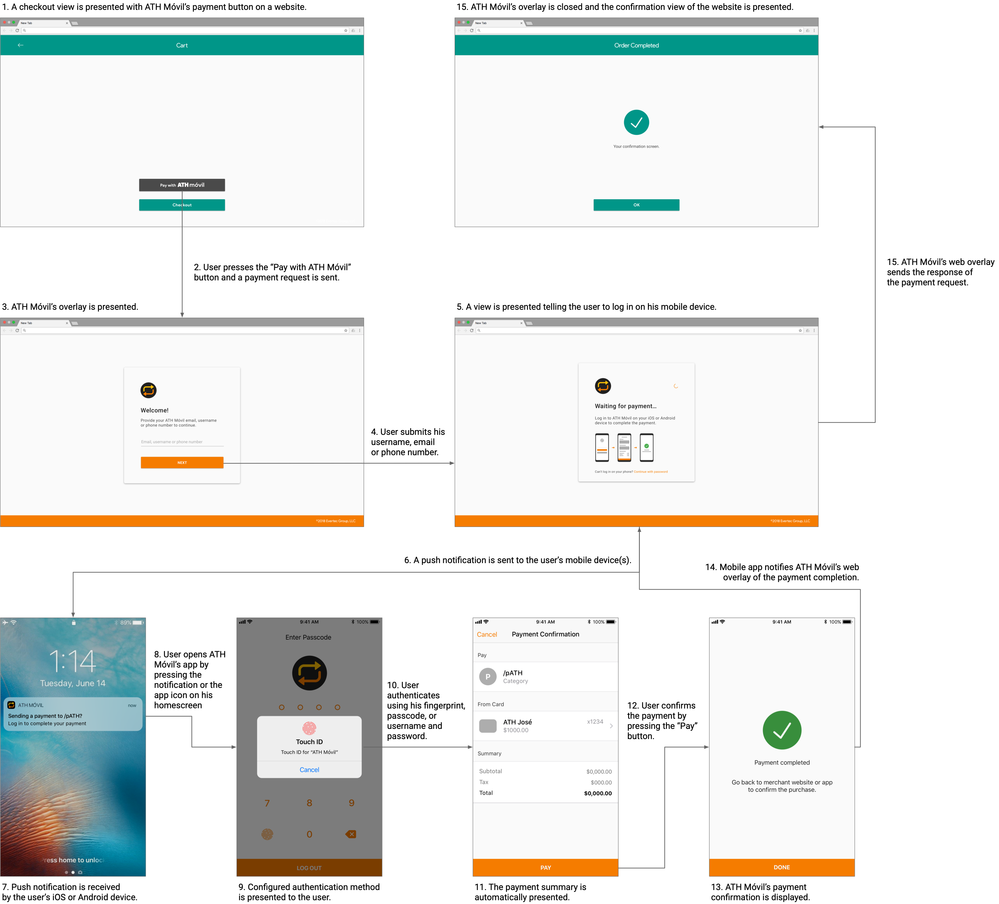

# ATH Móvil Payment Button - Javascript Integration and Services

## Introduction
ATH Móvil's Javascript integration provides a simple, secure and fast checkout experience to customers paying on your website. After integrating our Payment Button on your website, you will be able to receive real time payments from more than 1.5 million ATH Móvil users.

## Prerequisites
Before you begin, please review the following prerequisites:

1. An active ATH Móvil Business account is required to continue. To sign up, download "ATH Móvil Business" on the App Store or Play Store of your iOS or Android device.


2. Your ATH Móvil Business account needs to have a registered, verified and active ATH® card.

3. Have the public and private API keys of your Business account at hand. **You can view your API keys on the settings section of ATH Móvil Business for iOS or Android.**

## Support
If you need help signing up, adding a card or have any other question please refer to https://athmovilbusiness.com/preguntas or contact our support team at (787) 773-5466. For technical support please complete the following form:  https://forms.gle/ZSeL8DtxVNP2K2iDA.

## Installation
Before getting started you will need to add references to both jQuery and ATH Móvil's javascript on your project's HTML checkout file.
```javascript
<script src="https://ajax.googleapis.com/ajax/libs/jquery/3.3.1/jquery.min.js"></script>
```
```javascript
<script src="https://www.athmovil.com/api/js/v3/athmovilV3.js"></script>
```
*Notes:*
* *ATH Móvil's javascript must be referenced at the bottom of the document since some variables need to be previously initialized.*
* *jQuery can be referenced on any location. Local versions can also be used. Version 3.3.1 or higher is required.*

## Usage
To integrate ATH Móvil’s Payment Button on your website follow these steps:

### HTML
Add the “Pay with ATH Móvil” button to your checkout view.
```html
  <div id="ATHMovil_Checkout_Button"></div>
```
* Button width is set to fill its parent.
* Button height is proportional to the width.

---

### Javascript
Configure the payment values using the javascript script below on your checkout view.
```javascript
<script type="text/javascript">

    ATHM_Checkout = {

        env: 'sandbox',
        publicToken: 'sandboxtoken01875617264',

        timeout: 600,

        theme: 'btn',
        lang: 'en',

        total: 1.00,
        tax: 1.00,
        subtotal: 1.00,

        metadata1: 'metadata1 test',
        metadata2: 'metadata2 test',

        items: [
            {
                "name":"First Item",
                "description":"This is a description.",
                "quantity":"1",
                "price":"1.00",
                "tax":"1.00",
                "metadata":"metadata test"
            },
            {
                "name":"Second Item",
                "description":"This is another description.",
                "quantity":"1",
                "price":"1.00",
                "tax":"1.00",
                "metadata":"metadata test"
            }
        ]
    }
</script>

```
* Details:

| Variable  | Data Type | Required | Values | Description |
| ------------- |:-------------:|:-----:| ------------- |  ------------- |
| `env` | String  | Yes | `sandbox` or  `production` | Determines the environment to be used for the payment. Use `sandbox` for simulated payment responses or `production` for real payments. |
| `publicToken` | String | Yes | Business account public token. | Determines the Business account that the payment will be sent to. |
| `timeout` | Number | No | Number between `120` and `600`. | Cancels the payment process if the payment hasn't been completed by the end user after the provided amount of time (in seconds). Timer starts immediately after the end user presses the Payment Button. Default value is set to 600 seconds (10 mins). |
| `theme` | String | Yes | `btn`, `btn-dark` or `btn-light`. | Determines the colors of the “Pay with ATH Móvil” button that is displayed on your view. |
| `lang` | String | Yes | `en` for english or `es` for spanish. | Determines the language of the “Pay with ATH Móvil” button and the payment process.|
| `total` | Number | Yes | From `1.00` to `1500.00`. |  Total amount to be paid by the end user. |
| `tax` | Number | No || Optional  variable to display the payment tax (if applicable). |
| `subtotal` | Number | No || Optional variable to display the payment subtotal to the end user (if applicable). |
| `metadata1` | String | No || Optional variable to attach key-value data to the payment object. |
| `metadata2` | String | No || Optional variable to attach key-value data to the payment object. |
| `items` | Array | Yes || Optional variable to display the items that the user is purchasing on ATH Móvil's payment screen. *`metadata` and `tax` are required but they can be set as `null`.* |

* `theme`:

| Theme | Example |
| ------------- |-------------|
| `btn` |  |
| `btn-light` |  |
| `btn-dark` |  |

* `lang`:

| Languages | Example |
| ------------- |-------------|
| `en` |  |
| `es` |  |

Handle all payment responses.
* Completed
```javascript
 onCompletedPayment: function (response)
		 {
				 //Handle response
		 },
```


* Cancelled
```javascript
onCancelledPayment: function (response)
		{
				//Handle response
		},
```


* Expired
```javascript
onExpiredPayment: function (response)
		{
				//Handle response
		}
```

* Completed `response` data example
```javascript
{
    "status": "completed",
    "date": "2019-06-06 16:12:02.0",
    "referenceNumber": "a387643827-fdew98ffw9fbfewkjb",
    "dailyTransactionID": "1234",
    "name": "Valeria Herrero",
    "phoneNumber": "7871234567",
    "email": "valher@gmail.com",
    "message": "",
    "total": 1.00,
    "tax": 1.00,
    "subtotal": 1.00,
    "fee": 0.06,
    "netAmount": 0.94,
    "totalRefundedAmount": 0.00,
    "metadata1": "metadata1 test",
    "metadata2": "metadata2 test",
    "items": "[{\"name\":\"First Item\",\"description\":\"This is a description.\",\"quantity\":\"1\",\"price\":\"1.00\",\"tax\":\"1.00\",\"metadata\":\"metadata test\"},{\"name\":\"Second Item\",\"description\":\"This is another  description.\",\"quantity\":\"1\",\"price\":\"1.00\",\"tax\":\"1.00\",\"metadata\":\"metadata test\"}]"
}
```

## Testing
To test ATH Móvil’s Payment Button on your website follow these steps:
* Set `env` to `sandbox`.

* Set `publicToken` to `sandboxtoken01875617264`.

* Test the payment process with the new configuration.

* Use any username and password to log in.

* Complete, cancel or wait for the payment to expire to test all possible responses.


## Services
The following services can be used to search for transactions, perform refunds and request information of multiple payments received in a given time frame.

### Search
* Method:` POST`
* Headers: `Content-Type` -	`application/json`
* Endpoint: `https://www.athmovil.com/api/v4/searchTransaction`
* Body Example:
```javascript
{
    "publicToken": "hdb932832klnasKJGDW90291",
    "privateToken": "JHEFEWP2048FNDFLKJWB2",
    "referenceNumber": "a387643827-fdew98ffw9fbfewkjb",
    "dailyTransactionID": "1234",
    "name": "Valeria Herrero",
    "phoneNumber": "(787) 123-4567",
    "email": "valher@gmail.com",
    "total": "1.00",
    "metadata1": "metadata1 test",
    "metadata2": "metadata2 test"
}
```
  * *Only `publicToken`, `privateToken`any other field is required to search for a transaction.*
  * *The value of phoneNumber needs to be formatted as in the provided example.*
  * *To find results the provided field value must be an exact match with the field value of at least one transaction.*
  * *Multiple fields can be used simultaneously on the request.*

* Reponse Example:
```javascript
{
    "transactionType": "ECOMMERCE",
    "status": "COMPLETED",
    "date": "2019-06-06 16:12:02.0",
    "referenceNumber": "402894d56b240610016b2e6c78a6003a",
    "dailyTransactionID": 1,
    "name": "Valeria Herrero",
    "phoneNumber": "(787) 123-4567",
    "email": "valher@gmail.com",
    "message": "",
    "total": 1.00,
    "tax": 1.00,
    "subtotal": 1.00,
    "fee": 0.06,
    "netAmount": 0.94,
    "totalRefundedAmount": 0.00,
    "metadata1": "metadata1 test",
    "metadata2": "metadata2 test",
    "items": [
      {
        "name": "First Item",
        "description": "This is a description.",
        "quantity": 1,
        "price": 1.00,
        "tax": 1.00,
        "metadata": "metadata test"
      },
      {
        "name": "Second Item",
        "description": "This is another description.",
        "quantity": 1,
        "price": 1.00,
        "tax": 1.00,
        "metadata":"metadata test"
      }
    ]
}
```
  * *If more than one transaction matches the provided fields all matching payments will be sent on the response as a list.*

----

### Refund
* Method:` POST`
* Headers: `Content-Type` -	`application/json`
* Endpoint: `https://www.athmovil.com/api/v4/refundTransaction`
* Body Example:
```javascript
{
    "publicToken": "hdb932832klnasKJGDW90291",
    "privateToken": "JHEFEWP2048FNDFLKJWB2",
    "referenceNumber": "fdew98ffw9fbfewkjb"
    "amount":"1.00"
}
```
* Response Example:
```javascript
{
    "refund": {
        "transactionType": "REFUND",
        "status": "COMPLETED",
        "refundedAmount": 1.00,
        "date": "2021-07-08 18:13:58.0",
        "referenceNumber": "402894d56b240610016b2e6c78a6003a",
        "dailyTransactionID": 107,
        "name": " Valeria Herrero",
        "phoneNumber": "(787) 123-4567",
        "email": "valher@gmail.com"
    },
    "originalTransaction": {
        "transactionType": "PAYMENT",
        "status": "COMPLETED",
        "date": "2021-07-08 18:12:00.0",
        "referenceNumber": "402894d56b240610016b2e6c78a6003a",
        "dailyTransactionID": 106,
        "name": "Valeria Herrero",
        "phoneNumber": "(787) 123-4567",
        "email": "valher@gmail.com",
        "message": "",
        "total": 1.00,
        "tax": 0.00,
        "subtotal": 0.00,
        "fee": 0.00,
        "netAmount": 0.00,
        "totalRefundedAmount": 1.00,
        "metadata1": "metadata1 test",
        "metadata2": "metadata2 test",
        "items": []
    }
}
```
----

### Transaction Report
* Method:` GET`
* Headers: `Content-Type` -	`application/json`
* Endpoint: `https://www.athmovil.com/transactions/v4/transactionReport`
* Body Example:
```javascript
{
    "publicToken": "hdb932832klnasKJGDW90291",
    "privateToken": "JHEFEWP2048FNDFLKJWB2",
    "fromDate": "2019-01-01 16:12:02",
    "toDate":"2019-06-06 16:12:02"
}
```
* Response Example:
```javascript
[
    {
        "transactionType": "ECOMMERCE",
        "status": "COMPLETED",
        "date": "2021-07-08 00:36:39.0",
        "referenceNumber": "402894d56b240610016b2e6c78a6003a",
        "dailyTransactionID": 35,
        "name": "Valeria Herrero",
        "phoneNumber": "(787) 123-4567",
        "email": "valher@gmail.com",
        "message": "",
        "total": 1.00,
        "tax": 0.00,
        "subtotal": 0.00,
        "fee": 0.00,
        "netAmount": 1.00,
        "totalRefundAmount": 1.00,
        "metadata1": "metadata1 test",
        "metadata2": "metadata2 test",
        "items": [
            {
                "name": "Item",
                "description": "Description",
                "quantity": 1,
                "price": 1.00,
                "tax": 0.00,
                "metadata": "Metadata"
            },
            {
                "name": "item",
                "description": "desc",
                "quantity": 1,
                "price": 1.00,
                "tax": 0.00,
                "metadata": "Metadata"
                }
            ]
        },
        {
            "transactionType": "ECOMMERCE",
            "status": "COMPLETED",
            "date": "2021-07-08 00:35:43.0",
            "referenceNumber": "402894d56b240610016b2e6c78a6003a ",
            "dailyTransactionID": 33,
            "name": "Valeria Herrero",
            "phoneNumber": "(787) 123-4567",
            "email": "valher@gmail.com",
            "message": "",
            "total": 5.00,
            "tax": 1.00,
            "subtotal": 2.00,
            "fee": 0.00,
            "netAmount": 5.00,
            "totalRefundAmount": 5.00,
            "metadata1": "metadata1 test",
            "metadata2": "metadata1 test",
            "items": [
                {
                    "name": "Nombre de arreglo",
                    "description": "Prueba de items",
                    "quantity": 3,
                    "price": 2.00,
                    "tax": 1.00,
                    "metadata": "prueba metadata"
                }
            ]
        }
    ]
```
----

## User Experience


## Legal
The use of this API and any related documentation is governed by and must be used in accordance with the Terms and Conditions of Use of ATH Móvi Business ®, which may be found at: https://athmovilbusiness.com/terminos.
